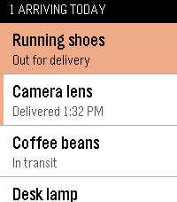
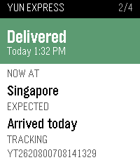
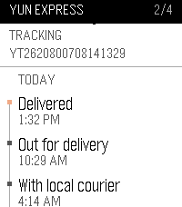

# Parcel Tracking for Pebble

**[⌚ Install from the Rebble appstore](https://apps.repebble.com/b29dcf9df26f41888a420a31)**

Check your parcels from your wrist. See every parcel's current delivery status
at a glance, then open one for its full carrier timeline.

Tracking data comes from [Ship24](https://www.ship24.com), which covers 1,500+
carriers. You bring your own API key — nothing goes through anyone else's server.

## Screens

| Parcel list | Parcel detail | Its history |
|:---:|:---:|:---:|
|  |  |  |

- **Parcel list** — one row per parcel: your name for it and its status. The
  title bar answers "is anything arriving today?", and on colour watches a
  stripe in the left gutter marks the rows that land today.
- **Parcel detail** — one scrolling page: the status headline on a
  status-coloured block (green delivered, red exception, orange out for
  delivery, blue in transit), then where the parcel is now, when it's expected,
  and the tracking number.
- **History** — keep scrolling on that same page for every carrier scan, newest
  first, grouped by day, with the time and any change of location.

## Controls

| Button              | Action                          |
|---------------------|---------------------------------|
| Up / Down           | Move through the list           |
| Select              | Open the parcel                 |
| **Long-press Select** | Force a refresh from Ship24   |
| Back                | Return to the previous screen   |

Results are cached on your phone for 5 minutes, so reopening the app is instant
and doesn't spend API calls.

## Setup

1. **Get a Ship24 API key.** Sign up at
   [dashboard.ship24.com](https://dashboard.ship24.com), then
   **Integrations → API Keys**.
2. **Install the app** on your watch.
3. **Open the app's settings** from the Pebble phone app
   (the gear icon next to Parcel Tracking).
4. Paste your API key, add a parcel (a name, the tracking number, and
   optionally a courier — start typing and pick it from the list of every
   courier Ship24 supports, or leave it blank to let Ship24 work it out), and
   tap **Save**.

Your watch picks up the new parcels straight away. Up to 12 parcels are shown.

Your API key is stored only on your phone and is sent only to `api.ship24.com`.

## Building it yourself

Requires the [Pebble SDK](https://github.com/pebble-dev/pebble-tool).

```sh
cd watch
pebble build
pebble install --emulator basalt     # or --phone <ip>
```

The settings page is `docs/index.html`, served via GitHub Pages from the `/docs`
folder on `main`. If you fork this, enable Pages on your fork and point
`CONFIG_URL` at the top of `watch/src/pkjs/index.js` at your own URL — otherwise
the settings screen won't load.

Tests for the phone-side bridge and the settings page:

```sh
cd tools
npm install
npm test
```

## Not included

Background polling and push notifications on status change. The app refreshes
when you open it or long-press Select.
